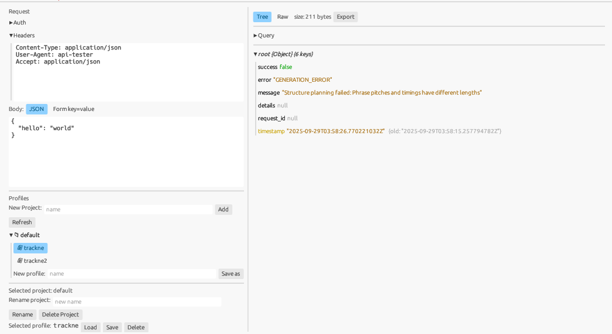

# API Tester (Rust + egui)

A lightweight, fast native GUI tool to test and visualize REST APIs. It targets JSON payloads up to around 1 MB (handled with `serde`) and focuses on dense information display, inline structural diffs, and powerful querying (JSONPath/JMESPath).

This repository ships a GitHub Actions workflow: pushing a Git tag like `v0.1.0` triggers a multi‑OS build and publishes downloadable binaries to GitHub Releases automatically.

## Features
- HTTP methods: GET / POST / PUT / PATCH / DELETE
- Background request execution (prevents UI freeze)
- Authentication: None / Basic / Bearer / OAuth2 Token
- Header editor (one per line: `Key: Value`)
- Request Body:
  - JSON editor (pretty-printed)
  - Form key=value editor with compact rows (+Add, delete, enable/disable)
  - Bidirectional sync between JSON and Form (always consistent)
- Response display:
  - Tree view with collapsible Object/Array nodes
  - Scrollable area for large payloads
  - Status colorization (200=green, 3xx/others=yellow, 4xx/5xx=red)
- Diff (mandatory requirement):
  - Structural diff using `json_patch::diff` applied inline to the Tree
  - For replaced nodes, show current value with the old value in gray beside it
- Query (always applied to the Tree view):
  - JSONPath (extraction)
  - JMESPath (extraction + transformation)
  - Press Run to apply the result directly as the Tree content
- Search (plain text): list matching pretty‑JSON lines with line numbers
- Profiles management (project/folder based):
  - Stored at `./profiles/<project>/<profile>.json`
  - Folder-like explorer UI (projects as folders, profiles as files)
  - New / Save / Overwrite / Load / Delete / Rename (for both projects and profiles)
- cURL import: basic parsing for method/url/headers/body
- Export: JSON, NDJSON (for arrays), CSV (flattened arrays of objects)
- Auto polling: periodically send requests; inline diff highlights changes
- Window Always‑on‑Top toggle (Float/Unfloat)
- Compact UI (tight spacing and font size)

## Screenshot


## Usage
1. Set the URL and HTTP method.
2. Optionally edit Auth/Headers/Body.
   - Body can be switched between JSON and Form; both stay in sync.
3. Click Send; the request is executed in a background thread.
4. Inspect JSON in the Tree view (inline diff and old values are shown automatically).
5. Enter JSONPath or JMESPath in the Query section and hit Run; the Tree shows the filtered result.
6. Manage projects/profiles in the Profiles explorer (double‑click to load).
7. Use Export to save JSON/NDJSON/CSV.

## Install
- Download the archive for your OS from GitHub Releases and extract it.
  - Example: `api-tester-v0.1.0-windows-x86_64.tar.gz`
- On Windows, the MSVC runtime might be required. If the app does not start, install the Visual C++ Redistributable.

## Automatic release (GitHub Actions via tags)
This repo contains `.github/workflows/release.yml`. Pushing a tag that matches `v*` will trigger CI.

Steps:
```
# Commit your changes
git add -A
git commit -m "chore: prepare v0.1.0"

# Create a tag
git tag v0.1.0

# Push the tag
git push origin v0.1.0
# or
# git push origin --tags
```
CI pipeline:
- Build release binaries on Windows / Linux / macOS
- Package the binary (and README / LICENSE / docs/sample.json if present) into an archive
- Generate SHA256 checksums
- Upload the assets to the corresponding GitHub Release

Note: The package name in Cargo.toml is `API-tester`. The workflow detects the actual binary name robustly (case/hyphen differences handled).

## Build from source
Ensure Rust stable is installed, then:
```
cargo build --release
```
Artifacts:
- Windows: `target\release\API-tester.exe`
- Linux/macOS: `target/release/API-tester`

## Tech stack
- GUI: eframe/egui (native)
- HTTP: reqwest (blocking)
- JSON: serde/serde_json
- Diff: json-patch (structural, mandatory), similar (text diff)
- Query: jsonpath_lib / jmespath
- Others: rfd (file dialogs), url, base64, csv, anyhow

## Roadmap
- Hints in the tree to make removed nodes (JSON Patch remove) discoverable
- Virtualized scrolling/pagination for very large arrays
- Additional auth flows (OAuth2 Code Flow)

## License
This project is licensed under the MIT License. See the LICENSE file at the repository root.

Third-party dependencies are licensed under permissive terms (MIT, Apache-2.0, Unlicense). A summary is available in THIRD_PARTY_LICENSES.md. For crates under Apache-2.0, the full Apache License text is included in LICENSE-APACHE-2.0.

## Translations
- Japanese documentation: [jp/README.md](jp/README.md) and [jp/CHANGELOG.md](jp/CHANGELOG.md)

## Changelog
See [CHANGELOG.md](CHANGELOG.md).
